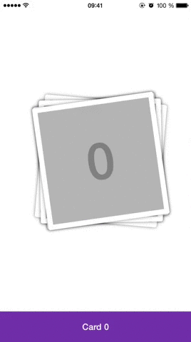
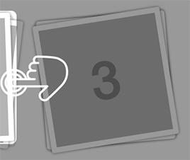

UPCardsCarousel
===============

`UPCardsCarousel` is a carousel with a cards based UI for iOS.



## Requirements

`UPCardsCarousel` uses ARC and requires iOS 7.0+.

Works for iPhone.

## Installation

### Manual

Simply copy the folder `UPCardsCarousel` to your project and import it with XCode.

## Usage

Start by importing the header file:

```objc
#import "UPCardsCarousel.h"
```

Now, you can create a `UPCardsCarousel` object by giving it a frame:

```objc
UPCardsCarousel *carousel = [[UPCardsCarousel alloc] initWithFrame:aFrame];
```

Then you need to assign to it:

* a `delegate` object that conforms to the `UPCardsCarouselDelegate` protocol
* a `dataSource` object that conforms to the `UPCardsCarouselDataSource` protocol

### Data Source

The data source informs the carousel about the total number of cards and the content of each card through two self-explanatory methods:

* `- (NSUInteger)numberOfCardsInCarousel:(UPCardsCarousel *)carousel` (required)
* `- (UIView *)carousel:(UPCardsCarousel *)carousel viewForCardAtIndex:(NSUInteger)index` (required)

The labels in the banner are given with an optional method. If the data source doesn't implement this method, the label banner will not be displayed.

* `- (NSString *)carousel:(UPCardsCarousel *)carousel labelForCardAtIndex:(NSUInteger)index` (optional)

### Delegate

The delegate is optional and will be notified when some events occur:

* `- (void)carousel:(UPCardsCarousel *)carousel didTouchCardAtIndex:(NSUInteger)index`
* `- (void)carousel:(UPCardsCarousel *)carousel willDisplayCardAtIndex:(NSUInteger)index`
* `- (void)carousel:(UPCardsCarousel *)carousel willHideCardAtIndex:(NSUInteger)index`
* `- (void)carousel:(UPCardsCarousel *)carousel didDisplayCardAtIndex:(NSUInteger)index`
* `- (void)carousel:(UPCardsCarousel *)carousel didHideCardAtIndex:(NSUInteger)index`

### Methods

| Method                                       | Description                                                                                                  |
|----------------------------------------------|--------------------------------------------------------------------------------------------------------------|
| reloadData                                   | Reloads the carousel data and recreates the visible cards and moves to the top of the cards deck             |
| reloadDataWithCurrentIndex:(NSUInteger)index | Reloads the carousel data and recreates the visible cards and moves to the specified index in the cards deck |
| reloadNumberOfCards                          | Reloads only the number of cards in the carousel and doesn't change the visible cards                        |
| reloadCardAtIndex:(NSUInteger)index          | Recreates the card at the specified index                                                                    |
| cardAtIndex:(NSUInteger)index                | Return the card view at the specified index                                                                  |

### Customization

#### Cards Deck

Usually, the carousel will not display all the cards supplied by the data source at once. It will handle a infinite scrolling process by destroying and creating cards at both ends. The number of visible cards is given and can be customized through the following property:

* `maxVisibleCardsCount` (default is 6)

You can customize the duration of the card movement between the hidden deck and the visible deck, with this property:

* `movingAnimationDuration` (defaut is 0.4 seconds)

By default, the carousel will return to the top of the deck when making a double-tap on the first hidden card.



You can disable this behaviour by setting the `doubleTapToTop` to `NO`.

#### Labels Banner

You can customize the text font and color of the banner through these two methods:

* `- (void)setLabelFont:(UIFont *)font` (default is system font)
* `- (void)setLabelTextColor:(UIColor*)color` (default is `[UIColor blackColor]`)

You can choose between two locations for the banner through the `labelBannerPosition` property:

* `UPCardsCarouselLabelBannerLocation_bottom` - the banner will be located below the cards deck (default)
* `UPCardsCarouselLabelBannerLocation_top` - the banner will be located above the cards deck

Finally you also have access to the banner view object through the `labelBanner` property so you can customize it as you want.

## License

The MIT License (MIT)

Copyright (c) 2014 Paul Ulric

Permission is hereby granted, free of charge, to any person obtaining a copy
of this software and associated documentation files (the "Software"), to deal
in the Software without restriction, including without limitation the rights
to use, copy, modify, merge, publish, distribute, sublicense, and/or sell
copies of the Software, and to permit persons to whom the Software is
furnished to do so, subject to the following conditions:

The above copyright notice and this permission notice shall be included in all
copies or substantial portions of the Software.

THE SOFTWARE IS PROVIDED "AS IS", WITHOUT WARRANTY OF ANY KIND, EXPRESS OR
IMPLIED, INCLUDING BUT NOT LIMITED TO THE WARRANTIES OF MERCHANTABILITY,
FITNESS FOR A PARTICULAR PURPOSE AND NONINFRINGEMENT. IN NO EVENT SHALL THE
AUTHORS OR COPYRIGHT HOLDERS BE LIABLE FOR ANY CLAIM, DAMAGES OR OTHER
LIABILITY, WHETHER IN AN ACTION OF CONTRACT, TORT OR OTHERWISE, ARISING FROM,
OUT OF OR IN CONNECTION WITH THE SOFTWARE OR THE USE OR OTHER DEALINGS IN THE
SOFTWARE.
